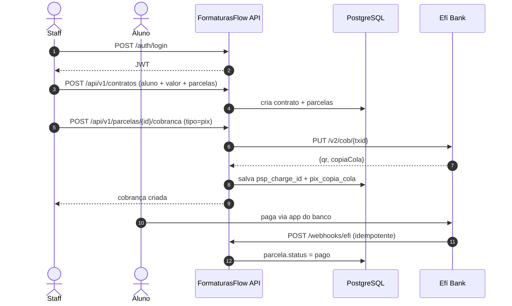

<div align="center">

# FormaturasFlow API

**Backend .NET 10 para gestão de turmas, contratos e cobranças de formatura.**

[](https://dotnet.microsoft.com/)
[](https://www.postgresql.org/)
[](#)
[](#)

[Getting Started](docs/getting-started.md) ·
[Architecture](docs/architecture.md) ·
[API Reference](docs/api-reference.md) ·
[Authentication](docs/authentication.md) ·
[Efí Bank](docs/efi-integration.md) ·
[Database](docs/database.md) ·
[Deployment](docs/deployment.md)

</div>

---

## O que é

Uma API REST em **ASP.NET Core 10 Minimal APIs** que suporta a operação da JM Formaturas & Eventos: gestão de turmas de formandos, contratos com parcelamento, emissão de cobranças (boleto e PIX) via **Efí Bank** e conciliação automática por webhook.

> **Estágio atual:** integração Efí Bank pronta em código, aguardando cadastro no sandbox. Front-end React (`../formaturas-flow`) ainda usa Supabase e será migrado gradualmente na próxima fase.

## Highlights

|  | Escolha | Motivo |
|---|---|---|
| **Framework** | .NET 10 Minimal APIs | Padrão recomendado pela Microsoft para novos serviços — menor boilerplate, mesma performance |
| **Persistência** | EF Core 10 + Npgsql | ORM oficial + provider Postgres maduro |
| **Auth** | ASP.NET Core Identity + JWT Bearer | Hash de senha industry-grade + tokens stateless |
| **API Docs** | OpenAPI 3.1 nativo + Scalar | Sem Swashbuckle — spec gerada pelo próprio runtime |
| **PSP** | Efí Bank (ex-Gerencianet) | Boleto ~R$ 2, PIX gratuito, API pública com sandbox |
| **Container** | Multi-stage Dockerfile + non-root | Imagem enxuta pronta pra qualquer VPS |

## Quickstart

Três comandos e você tem a API rodando:

```powershell
git clone <repo> formaturas-api
cd formaturas-api
docker compose up -d
```

- API — <http://localhost:8080>
- Docs interativas (Scalar) — <http://localhost:8080/scalar>
- OpenAPI spec — <http://localhost:8080/openapi/v1.json>
- Health — <http://localhost:8080/health>

> Sem Docker? Veja [Getting Started](docs/getting-started.md) para as opções alternativas (Postgres nativo, Supabase remoto).

## Fluxo típico



## Estrutura do projeto

```
formaturas-api/
├── FormaturasFlow.slnx           # Solution (novo formato XML .NET 9+)
├── docker-compose.yml            # Postgres + API
├── src/FormaturasFlow.Api/
│   ├── Program.cs                # Bootstrap + wiring
│   ├── Auth/                     # JWT, Identity, endpoints /auth/*
│   ├── Data/                     # AppDbContext + ApplicationUser
│   ├── Domain/                   # Entidades (Turma, Aluno, Contrato...)
│   ├── Endpoints/                # CRUD por recurso
│   ├── Efi/                      # Client HttpClient + mTLS + webhook
│   ├── Migrations/               # dotnet ef
│   └── Dockerfile
└── docs/                         # Você está aqui
```

## Roadmap

- [x] Skeleton .NET 10 + Minimal APIs
- [x] EF Core + Npgsql + Migration inicial
- [x] Identity + JWT Bearer
- [x] Domínio (Turma, Aluno, Contrato, Parcela, Despesa)
- [x] Endpoints REST com role-based authorization
- [x] Integração Efí Bank (Boleto + PIX + Webhook)
- [x] Docker multi-stage + docker-compose
- [ ] Refactor do front (`formaturas-flow`) para consumir esta API
- [ ] CI/CD (GitHub Actions → Hostinger VPS)
- [ ] Testes de integração com Testcontainers
- [ ] Rate limiting nos endpoints públicos

## Documentação

|  | Arquivo | Descrição |
|---|---|---|
| Setup | [Getting Started](docs/getting-started.md) | Instalação passo a passo (Docker / Postgres nativo / Supabase) |
| Design | [Architecture](docs/architecture.md) | Camadas, decisões, diagramas |
| Segurança | [Authentication](docs/authentication.md) | JWT, roles, exemplos de uso |
| Contratos | [API Reference](docs/api-reference.md) | Todos os endpoints com curl + resposta |
| Cobrança | [Efí Bank Integration](docs/efi-integration.md) | Setup, mTLS, PIX/Boleto, webhook |
| Dados | [Database](docs/database.md) | Schema, migrations, seed |
| Ops | [Deployment](docs/deployment.md) | Docker, Hostinger VPS, produção |

## Referências oficiais

- [.NET 10 release notes](https://learn.microsoft.com/aspnet/core/release-notes/aspnetcore-10.0)
- [Minimal APIs overview](https://learn.microsoft.com/aspnet/core/fundamentals/minimal-apis/overview)
- [EF Core 10 + Npgsql](https://learn.microsoft.com/ef/core/providers/npgsql)
- [ASP.NET Core Identity](https://learn.microsoft.com/aspnet/core/security/authentication/identity-api-authorization)
- [OpenAPI nativo](https://learn.microsoft.com/aspnet/core/fundamentals/openapi/overview)
- [Efí Bank Developers](https://dev.efipay.com.br/docs)
